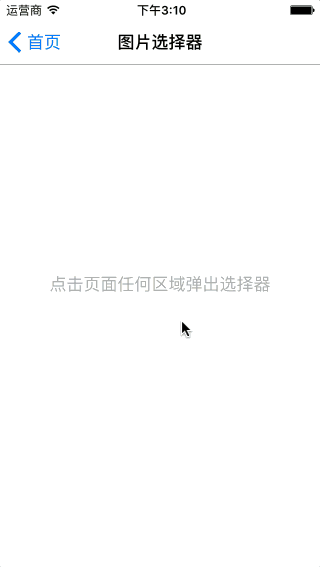
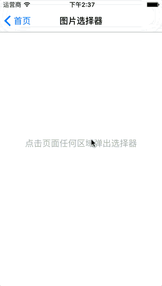
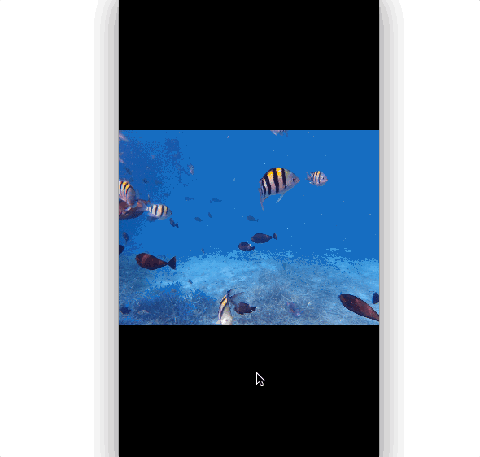

#照片选择器、图片浏览器 组件的DEMO

---


##USImagePickerController 

备注：iOS7~8.0使用ALAsset ----- iOS8.1及以上使用PHAsset




###Usages

1. Import header

	```objc
	#import "USImagePickerController.h"
	```

2. Create and present USImagePickerController

	```objc
	//选择多张照片
	USImagePickerController *controller = [[USImagePickerController alloc] init];
	controller.delegate = self;
	controller.allowsMultipleSelection = YES;
	controller.maxSelectNumber = 9;
	[self presentViewController:controller animated:true completion:nil];
	
	//选择单张照片
	USImagePickerController *controller = [[USImagePickerController alloc] init];
	controller.delegate = self;
	controller.allowsEditing = YES;
	controller.cropMaskAspectRatio = 1;
	[self presentViewController:controller animated:true completion:nil];
	```

3. 相关属性

	```objc
	/*!
	 @property
	 @brief 是否允许编辑选择的照片，默认为NO
	 */
	@property (nonatomic, assign) BOOL allowsEditing;
	
	/*!
	 @property
	 @brief 裁剪已选照片时的遮罩区域尺寸的宽高比(allowsEditing必须设置为YES)，默认为1
	 */
	@property (nonatomic, assign) CGFloat cropMaskAspectRatio;
	
	/*!
	 @property
	 @brief 是否允许选择多张照片，默认为NO
	 */
	@property (nonatomic, assign) BOOL allowsMultipleSelection;
	
	/*!
	 @property
	 @brief 在允许选择多张照片的情况，最大选择张数，默认无限制
	 */
	@property (nonatomic, assign) NSInteger maxSelectNumber;
	
	/*!
	 @property
	 @brief 是否已选择使用原图，默认为NO
	 */
	@property (nonatomic, assign, readonly) BOOL selectedOriginalImage;
	```

##ImagePickerSheetController

类似系统短信中的快速选择照片空间


###Usages

1. Import header

	```objc
	#import "ImagePickerSheetController.h"
	```

2. Create and present ImagePickerSheetController

	```objc
	ImagePickerSheetController *controller = [[ImagePickerSheetController alloc] init];
	controller.maximumSelection = 8;
	controller.displaySelectMaxLimit = YES;
	    
	ImageAction *action = [[ImageAction alloc] init];
	action.title = @"照片图库";
	action.style = ImageActionStyleDefault;
	[action setSecondaryTitle:^NSString *(NSInteger num) {
	    return [NSString stringWithFormat:@"发送 %@ 张照片",@(num)];
	}];
	[action setHandler:^(ImageAction *action) {
	    [self presentImagePickerController:UIImagePickerControllerSourceTypePhotoLibrary];
	}];
	[action setSecondaryHandler:^(ImageAction *action, NSInteger num) {
	    NSLog(@"controller.selectedImageAssets %@", controller.selectedImageAssets);
	}];
	[controller addAction:action];
	    
	action = [[ImageAction alloc] init];
	action.title = @"拍照";
	action.style = ImageActionStyleDefault;
	[action setSecondaryTitle:^NSString *(NSInteger num) {
	    return @"添加注释";
	}];
	[action setHandler:^(ImageAction *action) {
	    [self presentImagePickerController:UIImagePickerControllerSourceTypeCamera];
	}];
	[action setSecondaryHandler:^(ImageAction *action, NSInteger num) {
	    
	}];
	[controller addAction:action];
	    
	action = [[ImageAction alloc] init];
	action.title = @"取消";
	action.style = ImageActionStyleCancel;
	[controller addAction:action];
	    
	[self presentViewController:controller animated:true completion:nil];
	```

##USAssetsPageViewController

图片浏览器



###Usages

1. Import header

	```objc
	#import "USAssetsPageViewController.h"
	```

2. Create and present USImagePickerController

	```objc
	USAssetsPageViewController *pageVC = [[USAssetsPageViewController alloc] initWithAssets:_dataSource];
	pageVC.view.translatesAutoresizingMaskIntoConstraints = NO;
	    
	__weak typeof(self) weak_self = self;
	[pageVC setIndexChangedHandler:^(NSInteger index) {
	    [weak_self updateTitle:index];
	}];
	pageVC.pageIndex = 0;
	    
	[self.view addSubview:pageVC.view];
	[self addChildViewController:pageVC];
	    
	NSDictionary *views = @{@"view":pageVC.view};
	[self.view addConstraints:[NSLayoutConstraint constraintsWithVisualFormat:@"H:|-0-[view]-0-|" options:0 metrics:nil views:views]];
	[self.view addConstraints:[NSLayoutConstraint constraintsWithVisualFormat:@"V:|-0-[view]-0-|" options:0 metrics:nil views:views]];
	```
